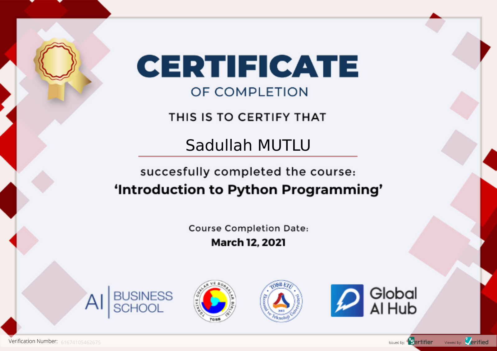
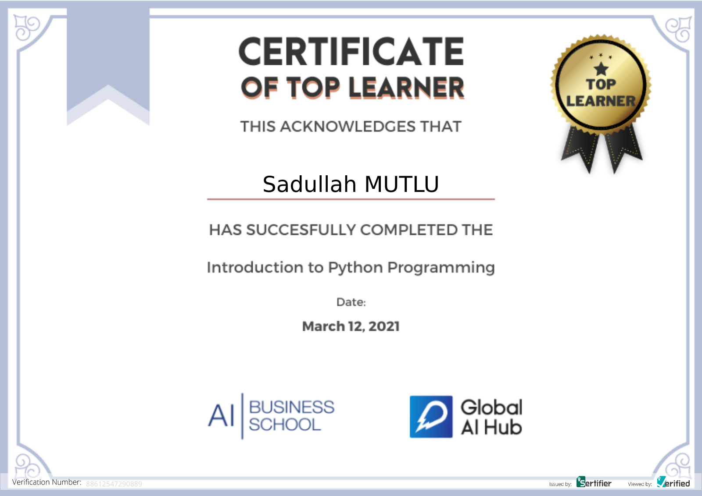

# Global AI Hub Python Course Repository

**Course Date:** 12.03.2021  
**Name:** Sadullah  
**Surname:** Mutlu  
**Email:** sadullahmutlu760@gmail.com  

**Note:** Kodların Hepsi  .py formatında yazılmıştır.

## Project Name
Ödevleri ve Eğitim sonunda verilmiş olan Final Ödevleri Hepsi Tamamlanmıştır ve Düzgün Çalışmaktadır.

## Requirements

---

### Certification

### Top Learner Certification

